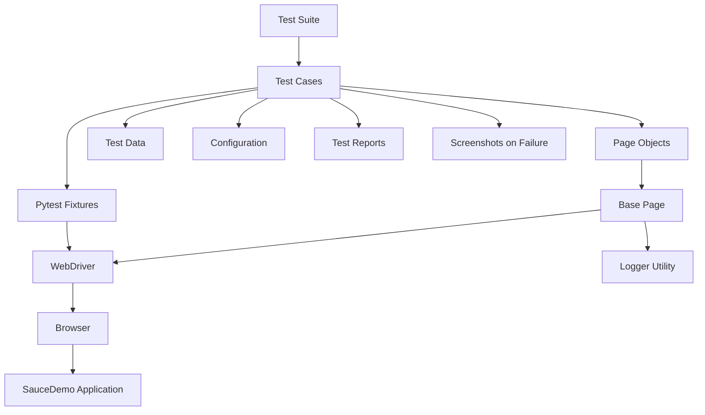
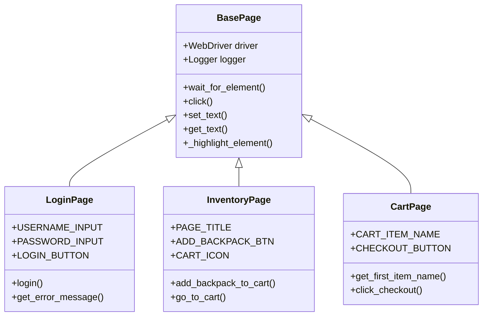
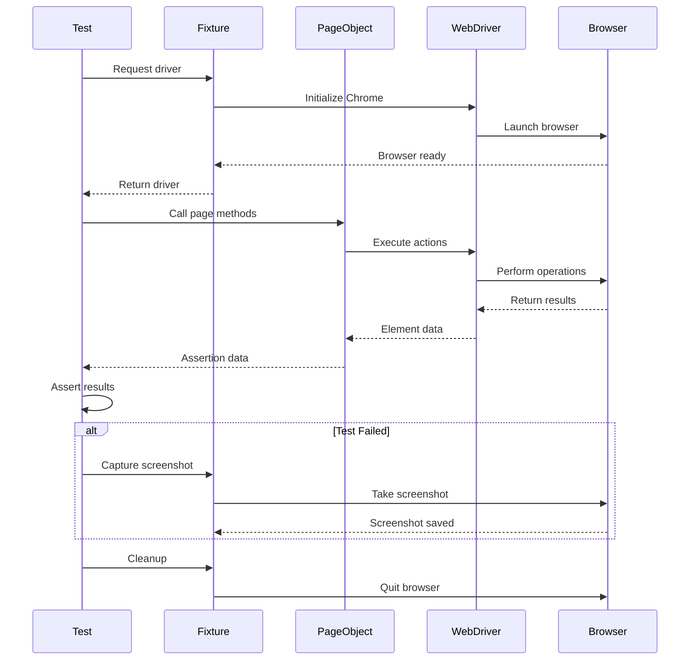
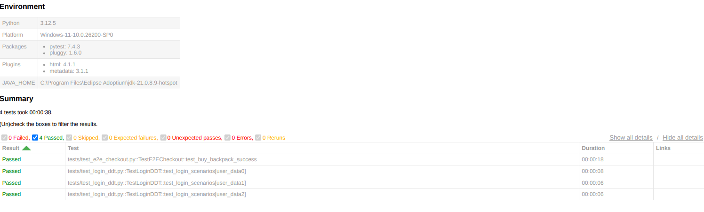

# E2E Web UI Automation Framework

A comprehensive end-to-end test automation framework built with Selenium WebDriver, Python, and Pytest, implementing the Page Object Model design pattern for testing the SauceDemo e-commerce application.

## Table of Contents

- [Overview](#overview)
- [Architecture](#architecture)
- [Key Features](#key-features)
- [Technology Stack](#technology-stack)
- [Project Structure](#project-structure)
- [Prerequisites](#prerequisites)
- [Installation](#installation)
- [Configuration](#configuration)
- [Usage](#usage)
- [Test Execution](#test-execution)
- [Reporting](#reporting)
- [Logging](#logging)
- [Screenshots](#screenshots)
- [Best Practices](#best-practices)
- [Contributing](#contributing)
- [License](#license)

## Overview

This automation framework provides a robust and scalable solution for automated testing of web applications. It demonstrates industry-standard practices including:

- **Page Object Model (POM)** design pattern for maintainable test code
- **Data-Driven Testing (DDT)** using external JSON data sources
- **Comprehensive logging** with multi-level logging handlers
- **Automatic screenshot capture** on test failures
- **HTML test reports** with detailed test execution results
- **Reusable components** through inheritance and fixtures

**Target Application:** [SauceDemo](https://www.saucedemo.com) - A demo e-commerce platform for automation testing

## Architecture

### Framework Architecture Diagram



### Page Object Model Structure



### Test Execution Flow



## Key Features

### Design Patterns and Best Practices

- **Page Object Model (POM)**: Separates page-specific code from test logic for better maintainability
- **DRY Principle**: Reusable base page class eliminates code duplication
- **Fixture Management**: Pytest fixtures for efficient test setup and teardown
- **Explicit Waits**: WebDriverWait ensures reliable element interactions
- **Element Highlighting**: Visual feedback during test execution for debugging

### Testing Capabilities

- **Data-Driven Testing**: Parametrized tests with external JSON data files
- **Multi-Scenario Testing**: Single test function handles multiple test cases
- **Positive and Negative Testing**: Validates both success and failure scenarios
- **End-to-End Testing**: Complete user workflows from login to checkout

### Reporting and Debugging

- **HTML Reports**: Comprehensive test execution reports with pytest-html
- **Structured Logging**: Multi-level logging (DEBUG, INFO, ERROR) to files and console
- **Failure Screenshots**: Automatic screenshot capture with timestamps on test failures
- **Sensitive Data Masking**: Passwords and sensitive information hidden in logs

### Framework Features

- **Virtual Environment**: Isolated Python environment for dependency management
- **Configuration Management**: Centralized configuration for easy environment switching
- **Browser Support**: Chrome browser with Selenium 4 auto-driver management
- **Scalable Architecture**: Easy to extend with new pages and test cases

## Technology Stack

| Component | Technology | Version |
|-----------|-----------|---------|
| Programming Language | Python | 3.12.5 |
| Test Framework | Pytest | 7.4.3 |
| Web Automation | Selenium WebDriver | 4.16.0 |
| Test Reporting | Pytest-HTML | 4.1.1 |
| Driver Management | Selenium Manager | Built-in |
| Browser | Google Chrome | Latest |

## Project Structure

```
E2E-Web-UI-Automation---Demo-App/
│
├── config.py                      # Configuration settings (URLs, credentials, browser)
├── conftest.py                    # Pytest fixtures and hooks
├── pytest.ini                     # Pytest configuration
├── requirements.txt.txt           # Python dependencies
├── README.md                      # Project documentation
├── LICENSE                        # License information
│
├── data/                          # Test data files
│   └── users.json                 # User credentials for data-driven testing
│
├── logs/                          # Log files directory
│   ├── automation.log             # Custom application logs
│   └── pytest.log                 # Pytest execution logs
│
├── pages/                         # Page Object classes
│   ├── base_page.py              # Base class with common methods
│   ├── login_page.py             # Login page object
│   ├── inventory_page.py         # Product inventory page object
│   └── cart_page.py              # Shopping cart page object
│
├── screenshots/                   # Failure screenshots
│   └── [test_name]_[timestamp].png
│
├── tests/                         # Test cases
│   ├── test_e2e_checkout.py      # End-to-end checkout test
│   └── test_login_ddt.py         # Data-driven login tests
│
└── utils/                         # Utility modules
    └── logger.py                  # Logging configuration
```

## Prerequisites

Before setting up the framework, ensure you have the following installed:

- **Python 3.8+**: [Download Python](https://www.python.org/downloads/)
- **Google Chrome**: Latest version
- **Git**: For version control (optional)
- **pip**: Python package installer (included with Python)

## Installation

### Step 1: Clone the Repository

```bash
git clone <repository-url>
cd E2E-Web-UI-Automation---Demo-App
```

### Step 2: Create Virtual Environment

**Windows:**
```powershell
python -m venv .venv
.venv\Scripts\Activate.ps1
```

**Linux/Mac:**
```bash
python3 -m venv .venv
source .venv/bin/activate
```

### Step 3: Install Dependencies

```bash
pip install -r requirements.txt.txt
```

Dependencies include:
- selenium==4.16.0
- pytest==7.4.3
- pytest-html==4.1.1
- webdriver-manager==4.0.1

### Step 4: Verify Installation

```bash
python --version
pip list
```

## Configuration

### Application Configuration

Edit `config.py` to modify test environment settings:

```python
class Config:
    BASE_URL = "https://www.saucedemo.com"
    USERNAME = "standard_user"
    PASSWORD = "secret_sauce"
    BROWSER = "chrome"
    IMPLICIT_WAIT = 10  # seconds
```

### Test Data Configuration

Edit `data/users.json` to add or modify test user scenarios:

```json
[
  {
    "username": "standard_user",
    "password": "secret_sauce",
    "should_pass": true,
    "error_msg": ""
  },
  {
    "username": "locked_out_user",
    "password": "secret_sauce",
    "should_pass": false,
    "error_msg": "Epic sadface: Sorry, this user has been locked out."
  }
]
```

### Pytest Configuration

The `pytest.ini` file contains test execution settings:

```ini
[pytest]
addopts = -v --strict-markers --tb=short
log_cli = true
log_cli_level = INFO
log_file = logs/pytest.log
log_file_level = DEBUG
```

## Usage

### Running Individual Tests

Execute a specific test file:

```bash
pytest tests/test_e2e_checkout.py -v
```

Execute a specific test case:

```bash
pytest tests/test_e2e_checkout.py::TestE2ECheckout::test_buy_backpack_success -v
```

### Running All Tests

Execute entire test suite:

```bash
pytest tests/ -v
```

### Running Tests with Markers

Execute tests by category (after adding markers):

```bash
pytest -m smoke -v              # Run smoke tests only
pytest -m regression -v         # Run regression tests only
pytest -m "not slow" -v         # Skip slow tests
```

## Test Execution

### Standard Execution

```bash
pytest tests/ -v
```

**Output:**
```
tests/test_e2e_checkout.py::TestE2ECheckout::test_buy_backpack_success PASSED
tests/test_login_ddt.py::TestLoginDDT::test_login_scenarios[user_data0] PASSED
tests/test_login_ddt.py::TestLoginDDT::test_login_scenarios[user_data1] PASSED
tests/test_login_ddt.py::TestLoginDDT::test_login_scenarios[user_data2] PASSED
```

### Headless Execution

For CI/CD or background execution, enable headless mode in `conftest.py`:

```python
options.add_argument("--headless")
```

Then run:
```bash
pytest tests/ -v
```

### Parallel Execution

Install pytest-xdist for parallel test execution:

```bash
pip install pytest-xdist
pytest tests/ -v -n 4  # Run with 4 parallel workers
```

### Live Log Viewing

View logs in real-time during test execution:

```bash
pytest tests/ -v --log-cli-level=INFO
```

## Reporting

### HTML Report Generation

Generate comprehensive HTML reports:

```bash
pytest tests/ -v --html=report.html --self-contained-html
```

**Report Contents:**
- Test execution summary
- Pass/fail statistics
- Execution duration
- System information
- Test environment metadata
- Individual test results with details

**Example Report Structure:**

```
HTML Report
├── Summary
│   ├── Total Tests: 4
│   ├── Passed: 4
│   ├── Failed: 0
│   └── Duration: 38.46s
├── Environment
│   ├── Python: 3.12.5
│   ├── Platform: Windows-11
│   └── Packages: pytest 7.4.3, selenium 4.16.0
└── Results
    ├── test_e2e_checkout.py::test_buy_backpack_success
    ├── test_login_ddt.py::test_login_scenarios[user_data0]
    ├── test_login_ddt.py::test_login_scenarios[user_data1]
    └── test_login_ddt.py::test_login_scenarios[user_data2]
```

### Viewing Reports

Open the generated report in a browser:

```bash
# Windows
start report.html

# Linux
xdg-open report.html

# Mac
open report.html
```



## Logging

### Log File Locations

The framework generates two types of logs:

1. **Pytest Logs**: `logs/pytest.log`
   - Selenium WebDriver operations
   - HTTP requests and responses
   - Browser interactions
   - Test execution flow

2. **Application Logs**: `logs/automation.log`
   - Custom page object actions
   - Element interactions
   - Test assertions
   - Error messages

### Log Levels

| Level | Description | Usage |
|-------|-------------|-------|
| DEBUG | Detailed diagnostic information | Selenium internals, element locators |
| INFO | General informational messages | User actions, page navigation |
| WARNING | Warning messages | Deprecated features, minor issues |
| ERROR | Error messages | Test failures, exceptions |
| CRITICAL | Critical failures | System crashes, fatal errors |

### Log Format

```
YYYY-MM-DD HH:MM:SS - LEVEL - MODULE - MESSAGE
```

**Example Log Entries:**

```log
2025-12-20 01:08:41 - INFO - LoginPage:base_page.py:36 - Entered text 'standard_user' into ('id', 'user-name')
2025-12-20 01:08:41 - INFO - LoginPage:base_page.py:36 - Entered text '*****' into ('id', 'password')
2025-12-20 01:08:41 - INFO - LoginPage:base_page.py:23 - Clicked on element: ('id', 'login-button')
2025-12-20 01:08:42 - INFO - InventoryPage:base_page.py:44 - Retrieved text 'Products' from ('class name', 'title')
```

### Viewing Logs

**View recent log entries:**
```bash
# Windows
Get-Content logs/pytest.log -Tail 50

# Linux/Mac
tail -50 logs/pytest.log
```

**Monitor logs in real-time:**
```bash
# Windows
Get-Content logs/pytest.log -Wait

# Linux/Mac
tail -f logs/pytest.log
```

## Screenshots

### Automatic Screenshot Capture

The framework automatically captures screenshots when tests fail:

**Location:** `screenshots/`

**Naming Convention:** `{test_name}_{timestamp}.png`

**Example:** `test_buy_backpack_success_2025-12-20_01-06-13.png`

### Screenshot Implementation

Screenshots are captured using a pytest hook in `conftest.py`:

```python
@pytest.hookimpl(tryfirst=True, hookwrapper=True)
def pytest_runtest_makereport(item, call):
    outcome = yield
    rep = outcome.get_result()
    
    if rep.when == "call" and rep.failed:
        driver = getattr(item, "driver", None)
        if driver:
            timestamp = datetime.datetime.now().strftime("%Y-%m-%d_%H-%M-%S")
            file_name = f"{item.name}_{timestamp}.png"
            file_path = os.path.join(SCREENSHOT_DIR, file_name)
            driver.save_screenshot(file_path)
```

### Screenshot Examples


**Checkout Error Screenshot:**


### Manual Screenshot Capture

To manually capture screenshots in tests:

```python
def test_manual_screenshot(self, driver):
    driver.get("https://www.saucedemo.com")
    driver.save_screenshot("screenshots/manual_capture.png")
```

## Best Practices

### Code Organization

1. **Keep page objects focused**: Each page object should represent one logical page or component
2. **Use meaningful locators**: Prefer IDs over XPath when possible
3. **Avoid test interdependencies**: Each test should be independent and self-contained
4. **Use fixtures for setup**: Leverage pytest fixtures for common setup operations

### Test Design

1. **Follow AAA pattern**: Arrange, Act, Assert in every test
2. **One assertion per test**: Keep tests focused on a single verification
3. **Use descriptive test names**: Test names should clearly describe what is being tested
4. **Implement data-driven tests**: Use external data sources for multiple test scenarios

### Maintenance

1. **Update locators centrally**: All locators in page objects, never in tests
2. **Regular dependency updates**: Keep libraries up to date for security and features
3. **Version control**: Commit frequently with meaningful commit messages
4. **Code reviews**: Review changes before merging to maintain code quality

### Performance

1. **Use explicit waits**: Avoid hard-coded sleep statements
2. **Optimize selectors**: Use efficient CSS selectors or IDs
3. **Parallel execution**: Run tests in parallel for faster feedback
4. **Headless mode**: Use headless browser for CI/CD pipelines


### Testing Changes

Before submitting, ensure:

```bash
# All tests pass
pytest tests/ -v

# Code follows style guidelines
pylint pages/ tests/ utils/

# No security vulnerabilities
bandit -r pages/ tests/ utils/
```

## License

This project is licensed under the MIT License - see the [LICENSE](LICENSE) file for details.

---


**Documentation Version:** 1.0.0