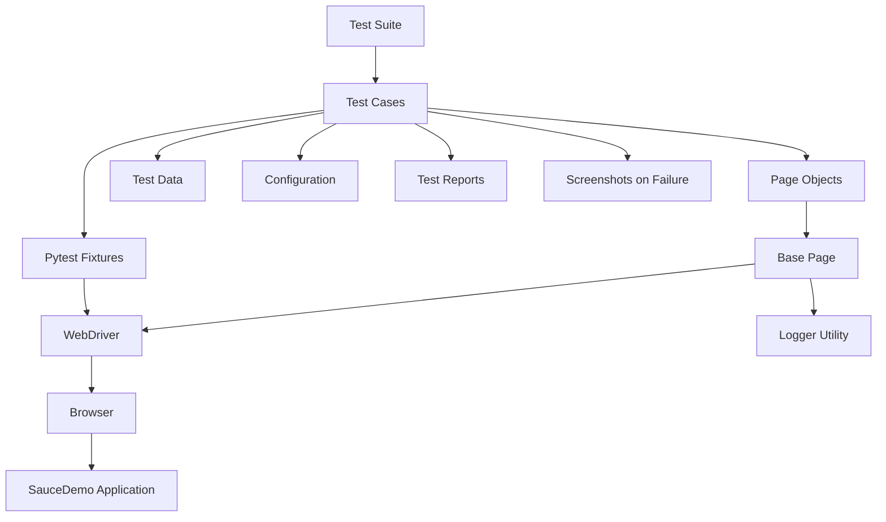
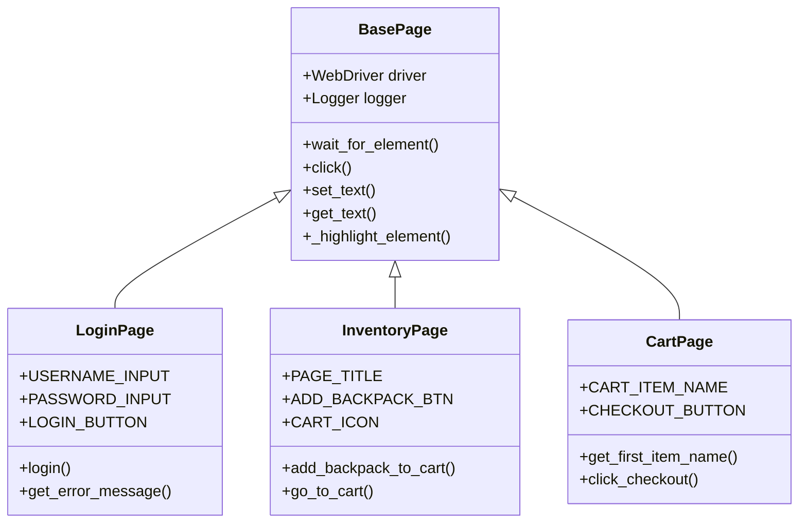
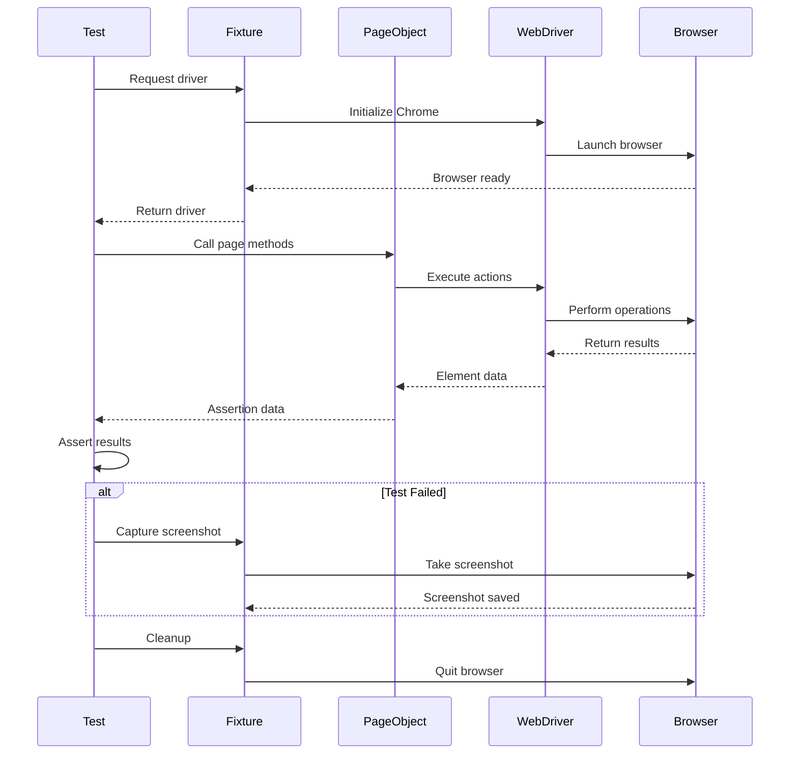
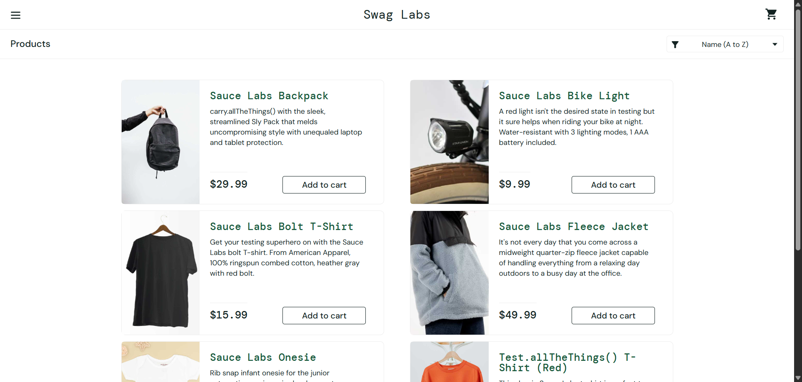

# E2E Web UI Automation Framework 🚀

Selenium-based test automation framework for the SauceDemo e-commerce application, featuring Page Object Model architecture, PostgreSQL test data management, and comprehensive reporting capabilities.

## Table of Contents

- [Overview](#overview)
- [Key Features](#key-features)
- [Technology Stack](#technology-stack)
- [Project Structure](#project-structure)
- [Setup](#setup)
- [Running Tests](#running-tests)
- [Database Configuration](#database-configuration)
- [Reports and Logging](#reports-and-logging)
- [Screenshots](#screenshots)
- [License](#license)

## Overview 📋

This framework implements industry-standard test automation practices for web applications. Test data is managed through PostgreSQL, enabling dynamic test scenario management without code changes. The framework targets [SauceDemo](https://www.saucedemo.com) for demonstration purposes.

**Core Capabilities:**
-  Page Object Model design pattern
-  Database-driven test data management
-  Parametrized test execution
-  Automatic failure screenshots
-  Multi-level logging system
-  HTML test reports

## Architecture 🏗️

### Framework Architecture Diagram



### Page Object Model Structure



###  Test Execution Flow



## Key Features ⭐

-  Page Object Model architecture for maintainability
-  PostgreSQL integration for centralized test data
-  Data-driven testing with pytest parametrization
-  Automatic screenshot capture on failures
-  Comprehensive logging with sensitive data masking
-  HTML reporting with execution details

## Technology Stack 🗄️

| Component | Technology | Version |
|-----------|-----------|---------|
| Language | Python | 3.12+ |
| Framework | Pytest | 7.4.3 |
| Automation | Selenium WebDriver | 4.16.0 |
| Database | PostgreSQL | Any |
| Driver | psycopg2-binary | 2.9.9 |
| Reporting | Pytest-HTML | 4.1.1 |

## Project Structure 📄

```
E2E-Web-UI-Automation---Demo-App/
├── config.py                      # Environment configuration
├── conftest.py                    # Pytest fixtures and hooks
├── pytest.ini                     # Test execution settings
├── requirements.txt.txt           # Dependencies
├── data/                          # JSON test data (optional)
├── logs/                          # Execution logs
├── pages/                         # Page Object classes
│   ├── base_page.py
│   ├── login_page.py
│   ├── inventory_page.py
│   └── cart_page.py
├── screenshots/                   # Failure screenshots
├── tests/                         # Test suites
│   ├── test_e2e_checkout.py
│   └── test_login_ddt.py
└── utils/                         # Utilities
    ├── logger.py
    └── db_manager.py              # PostgreSQL connection
```

## Setup ⚙️

**Prerequisites:**
- Python 3.8 or higher
- PostgreSQL database
- Google Chrome browser

**Installation:**

```powershell
# Create virtual environment
python -m venv .venv
.venv\Scripts\Activate.ps1

# Install dependencies
pip install -r requirements.txt.txt
```

**Configuration:**

Update database credentials in `utils/db_manager.py` if needed. Default settings:
- Host: localhost
- Port: 5432
- Database: postgres
- User: postgres
- Password: admin123

## Running Tests ▶️

**Execute all tests:**
```powershell
pytest tests/ -v --html=report.html --self-contained-html
```

**Execute specific test file:**
```powershell
pytest tests/test_login_ddt.py -v
```

**View live logs:**
```powershell
pytest tests/ -v --log-cli-level=INFO
```

## Database Configuration 💾

The framework retrieves test data from PostgreSQL. Test user credentials are stored in the `test_users` table.

**Create test data table:**
```sql
CREATE TABLE test_users (
    username VARCHAR(50),
    password VARCHAR(50),
    should_pass BOOLEAN,
    error_msg TEXT
);

INSERT INTO test_users (username, password, should_pass, error_msg) VALUES
('standard_user', 'secret_sauce', true, ''),
('locked_out_user', 'secret_sauce', false, 'Epic sadface: Sorry, this user has been locked out.'),
('invalid_user', 'wrong_password', false, 'Epic sadface: Username and password do not match any user in this service');
```

**Test database connection:**
```powershell
python utils/db_manager.py
```

## Reports and Logging 📊

**HTML Reports:**
Generated after each test run as `report.html` in the project root directory.

**Log Files:**
- `logs/pytest.log` - Detailed execution logs
- `logs/automation.log` - Application-specific logs

**Log Example:**
```log
2025-12-20 01:08:41 - INFO - LoginPage - Entered text 'standard_user' into ('id', 'user-name')
2025-12-20 01:08:41 - INFO - LoginPage - Entered text '*****' into ('id', 'password')
2025-12-20 01:08:41 - INFO - LoginPage - Clicked on element: ('id', 'login-button')
```

## Screenshots 📸

The framework automatically captures screenshots when tests fail, making it easier to debug issues.

**Features:**
- ✅ Automatic capture on test failures
- ✅ Timestamped filenames to prevent overwrites
- ✅ Saved in `screenshots/` directory
- ✅ Full page screenshots with browser state

**Screenshot Location:**
```
screenshots/
└── test_intentional_failure_for_screenshot_demo_2025-12-20_01-06-13.png
```

**Naming Convention:**
```
{test_name}_{timestamp}.png
```

**Example Screenshot:**

When a test fails, you'll see something like this in the terminal:
```
Screenshot saved to screenshots\test_login_failure_2025-12-20_01-06-13.png
```

**How it Works:**

The framework uses a pytest hook in `conftest.py` that automatically captures screenshots when any test fails:

```python
@pytest.hookimpl(tryfirst=True, hookwrapper=True)
def pytest_runtest_makereport(item, call):
    outcome = yield
    rep = outcome.get_result()
    
    if rep.when == "call" and rep.failed:
        driver = getattr(item, "driver", None)
        if driver:
            timestamp = datetime.datetime.now().strftime("%Y-%m-%d_%H-%M-%S")
            file_name = f"{item.name}_{timestamp}.png"
            file_path = os.path.join(SCREENSHOT_DIR, file_name)
            driver.save_screenshot(file_path)
```

**Screenshot Example:**




## License 📄

This project is licensed under the MIT License.
